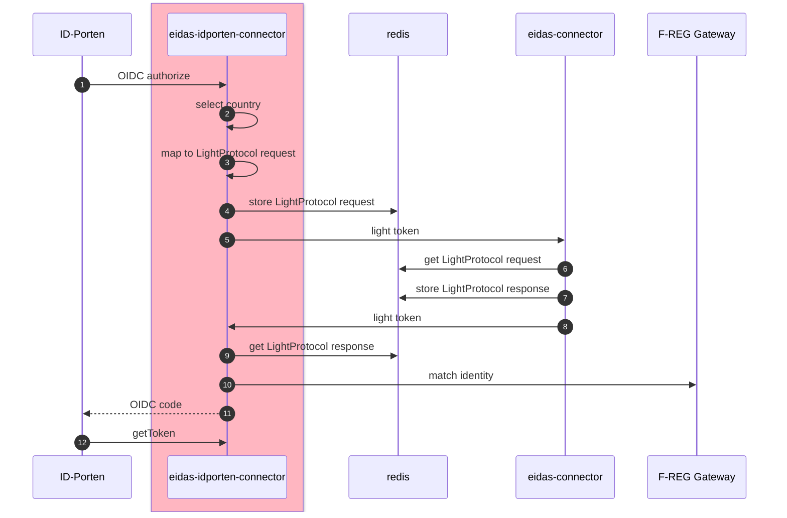

# eidas-idporten-connector

eIDAS spesific connector for ID-porten/Norway

## How to run

When running full stack or directly use acr eidas-loa-high

Minimum dependencies:

* demoland
* freg-gateway
* eidas-connector
* teknisk testklient

Test using the technical test client. example properties below

```
oidc-test-client:
  application-url: http://localhost:${server.port}${server.servlet.context-path}
  redirect-uri: ${oidc-test-client.application-url}authorize/response
  post-logout-redirect-uri: ${oidc-test-client.application-url}endsession/response
  openid-integrations:
    - id: eidas
      description: Integrasjon mot eidas Authentication localhost
      openid-provider:
        issuer: http://localhost:8088
      openid-client:
        client-id: testclient
        client-secret: password
        token-endpoint-auth-method: client_secret_basic
        redirect-uri: ${oidc-test-client.redirect-uri}
        post-logout-redirect-uri: ${oidc-test-client.post-logout-redirect-uri}
```  
## Sequence diagrams

