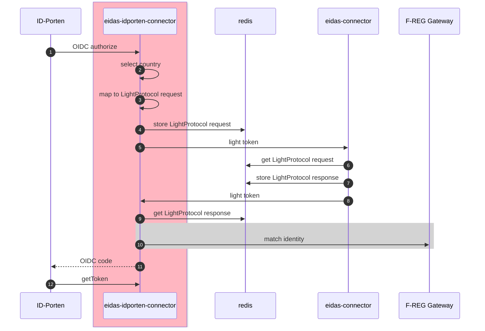

# eidas-idporten-connector

eIDAS spesific connector for ID-porten/Norway

We won't implement the freg gateway bit yet.

## Sequence diagrams

```mermaid  
sequenceDiagram
    autonumber
    participant IL as ID-Porten
    box lightpink 
        participant EIC as eidas-idporten-connector
    end
    participant RED as redis
    participant EC as eidas-connector
    participant FRG as F-REG Gateway
    
    
    IL ->> EIC: OIDC authorize
    EIC ->> EIC: select country
    EIC ->> EIC: map to LightProtocol request
    EIC ->> RED: store LightProtocol request
    EIC ->> EC: light token
    EC ->> RED: get LightProtocol request
    EC ->> RED: store LightProtocol response
    EC ->> EIC: light token
    EIC ->> RED: get LightProtocol response
    rect lightgrey
        EIC ->> FRG: match identity
    end
    EIC -->> IL: OIDC code
    IL ->> EIC: getToken

```    